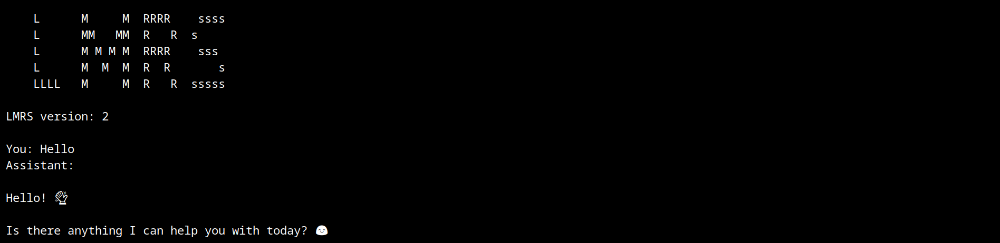

# Implementation of Gemma 2 compatible inference code in Rust



**Now supporting Gemma 2 2b! For Gemma 1 2b refer to the gemma1 branch.**

Inspired by Karpathy's [llama2.c](https://github.com/karpathy/llama2.c) and [llm.c](https://github.com/karpathy/llm.c) I decided to create the most minimal code that can perform full inference on Google's Gemma models on the CPU (only tested the 2B-it).

Disclaimer: most of the code could be optimized and improved (although it runs pretty fast on my 8 core laptop). This is just an excuse for me to write Rust for the first time. Isn't it incredible that in a few years, we could have AGI running with just **643** lines of poorly written Rust code?

Some things to do in the future:

- [ ] Add other sampling methods (currently only greedy).
- [ ] Test the 9B and 27B models (would probably have to change the code).
- [ ] Parallelize the multi head attention loop.
- [ ] Add performance metrics.
- [ ] Rust language optimizations.

## Instructions

Download the .safetensors and config file from [huggingface](https://huggingface.co/google/gemma-2-2b-it) (So we don't have to clone the pytorch repo).

Use the export.py file to convert the model weights into float32 LMRS format:

```properties
python export.py --files [safetensor files ordered] --config [model config.json] --save_path [name and path to save]
```

Download the .spm tokenizer model from [kaggle](https://www.kaggle.com/models/google/gemma-2) to this folder (in the gemma C++ version).

Use the tokenizer.py file to convert the tokenizer into LMRS tokenizer format:

```properties
python tokenizer.py
```

Finally compile the rust code with cargo:

```properties
cargo build --release
```

And you are good to go:

```properties
./target/release/chat -- [model weights file]
```

## License

MIT


